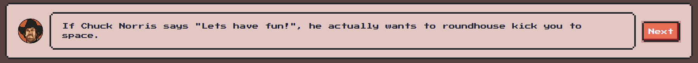

# Chuck Norris Jokes App

## Overview

Dive into classic Chuck Norris jokes with this app, built using HTML, CSS, TypeScript, and given a retro touch with NES.css. Enjoy timeless humor with an 8-bit gaming aesthetic.

Sumérgete en clásicas bromas de Chuck Norris con esta aplicación, construida usando HTML, CSS, TypeScript y dándole un toque retro con NES.css. Disfruta del humor atemporal con una estética de juego en 8 bits.

## Live Demo

Check out the live app here: [Chuck Norris Jokes App](https://homvi.github.io/chuck-norris-jokes/)

## Features

- Fetches jokes directly from the Chuck Norris Jokes API.
- Retro 8-bit gaming aesthetic thanks to NES.css.
- Responsive design to enjoy Chuck Norris humor on any device.

## Installation & Usage

1. **Clone the repository**

2. **Navigate to the project directory**

3. **Open `index.html` in a browser** 
Simply double-click the `index.html` file or use your preferred web server to serve the app.

## Technologies Used

- HTML
- CSS
- TypeScript
- NES.css

